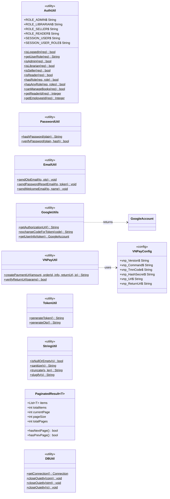

# Class Diagram - Digital Library Management System

## 1. Class Diagram - Domain Model (model package)

```mermaid
classDiagram
    direction TB

    %% ===== USER DOMAIN =====
    class Role {
        +Integer roleId
        +String roleName
        +String description
    }

    class Reader {
        +Integer readerId
        +String fullName
        +String email
        +String phone
        +String passwordHash
        +String avatarUrl
        +String status
        +int roleId
        +String roleName
        +LocalDateTime createdAt
        +LocalDateTime updatedAt
        +isActive() boolean
        +isBanned() boolean
        +hasPassword() boolean
        +getInitials() String
        +getDisplayAvatar() String
    }

    class Employee {
        +Integer employeeId
        +String fullName
        +String email
        +String passwordHash
        +String status
        +Integer roleId
        +String roleName
        +LocalDateTime createdAt
        +isActive() boolean
        +hasPassword() boolean
        +getAuthRole() String
        +getInitials() String
    }

    class LinkedAccount {
        +Integer linkedId
        +Integer readerId
        +String provider
        +String providerUserId
        +String email
        +LocalDateTime linkedAt
    }

    class GoogleAccount {
        +String sub
        +String email
        +String name
        +String picture
    }

    %% ===== BOOK DOMAIN =====
    class Author {
        +Integer authorId
        +String authorName
        +String bio
        +List~Book~ books
        +addBook(Book) void
        +removeBook(Book) void
        +getBookCount() int
    }

    class Category {
        +Integer categoryId
        +String categoryName
        +String description
        +List~Book~ books
        +addBook(Book) void
        +removeBook(Book) void
        +getBookCount() int
    }

    class Book {
        +Integer bookId
        +String title
        +String summary
        +String description
        +String coverUrl
        +String contentPath
        +BigDecimal price
        +String currency
        +Integer totalPages
        +Integer previewPages
        +String status
        +String language
        +Integer publicationYear
        +Integer authorId
        +Integer categoryId
        +Author author
        +Category category
        +LocalDateTime createdAt
        +LocalDateTime updatedAt
        +isAvailable() boolean
        +isFree() boolean
        +getFormattedPrice() String
        +isClassic() boolean
        +isRecent() boolean
    }

    class BookCopy {
        +Integer copyId
        +Integer bookId
        +String copyCode
        +String condition
        +String status
    }

    class ReaderBookOwnership {
        +Integer ownershipId
        +Integer readerId
        +Integer bookId
        +LocalDateTime purchasedAt
        +String source
    }

    %% ===== BORROW DOMAIN =====
    class BorrowRequest {
        +int requestId
        +int readerId
        +String status
        +LocalDateTime requestedAt
        +String note
        +Integer processedByEmployeeId
        +LocalDateTime processedAt
        +String decisionNote
        +List~BorrowRequestItem~ items
    }

    class BorrowRequestItem {
        +int itemId
        +int requestId
        +int bookId
        +int quantity
        +String bookTitle
    }

    class Borrow {
        +int borrowId
        +int readerId
        +Integer requestId
        +LocalDateTime borrowDate
        +String status
        +Integer approvedByEmployeeId
        +LocalDateTime createdAt
    }

    class BorrowItem {
        +int borrowItemId
        +int borrowId
        +int bookCopyId
        +LocalDateTime dueDate
        +LocalDateTime returnDate
        +String status
    }

    class BorrowExtend {
        +int extendId
        +int borrowItemId
        +LocalDateTime newDueDate
        +String status
        +LocalDateTime requestedAt
    }

    class Reservation {
        +int reservationId
        +int readerId
        +int bookId
        +String status
        +LocalDateTime reservedAt
        +LocalDateTime expiresAt
    }

    class Fine {
        +int fineId
        +int borrowItemId
        +int readerId
        +BigDecimal amount
        +String fineType
        +String status
        +LocalDateTime createdAt
    }

    %% ===== COMMERCE DOMAIN =====
    class Cart {
        +int cartId
        +int readerId
        +String status
        +LocalDateTime createdAt
        +LocalDateTime updatedAt
        +List~CartItem~ items
    }

    class CartItem {
        +int cartItemId
        +int cartId
        +int bookId
        +int quantity
        +BigDecimal unitPrice
        +String bookTitle
        +String bookCoverUrl
    }

    class Order {
        +int orderId
        +int readerId
        +BigDecimal totalAmount
        +String currency
        +String status
        +LocalDateTime createdAt
        +List~OrderBook~ orderBooks
    }

    class OrderBook {
        +int orderBookId
        +int orderId
        +int bookId
        +int quantity
        +BigDecimal unitPrice
        +String bookTitle
    }

    class Payment {
        +int paymentId
        +int orderId
        +BigDecimal amount
        +String paymentMethod
        +String paymentStatus
        +String transactionCode
        +LocalDateTime paidAt
        +LocalDateTime createdAt
    }

    %% ===== SOCIAL DOMAIN =====
    class Review {
        +int reviewId
        +int readerId
        +int bookId
        +Integer rating
        +String comment
        +LocalDateTime createdAt
        +LocalDateTime updatedAt
    }

    class Bookmark {
        +int bookmarkId
        +int readerId
        +int bookId
        +LocalDateTime createdAt
    }

    class ReadingHistory {
        +int historyId
        +int readerId
        +int bookId
        +int lastPageRead
        +LocalDateTime lastReadAt
        +LocalDateTime createdAt
    }

    class Notification {
        +Integer notificationId
        +Integer readerId
        +String title
        +String message
        +String notifType
        +boolean isRead
        +LocalDateTime createdAt
        +getTypeIcon() String
        +getTypeBadgeClass() String
        +getTimeAgo() String
    }

    class PasswordResetToken {
        +int tokenId
        +int readerId
        +String token
        +LocalDateTime expiresAt
        +boolean used
    }

    %% ===== RELATIONSHIPS =====
    Reader "1" --> "0..*" LinkedAccount : has
    Reader "1" --> "0..*" Cart : has
    Reader "1" --> "0..*" Order : places
    Reader "1" --> "0..*" BorrowRequest : submits
    Reader "1" --> "0..*" Borrow : has
    Reader "1" --> "0..*" Reservation : makes
    Reader "1" --> "0..*" Review : writes
    Reader "1" --> "0..*" Bookmark : saves
    Reader "1" --> "0..*" ReadingHistory : tracks
    Reader "1" --> "0..*" Notification : receives
    Reader "1" --> "0..*" ReaderBookOwnership : owns
    Reader "1" --> "0..*" Fine : incurs
    Reader "1" --> "1" Role : has

    Employee "1" --> "1" Role : has
    Employee "1" --> "0..*" BorrowRequest : processes
    Employee "1" --> "0..*" Borrow : approves

    Author "1" --> "0..*" Book : writes
    Category "1" --> "0..*" Book : contains
    Book "1" --> "0..*" BookCopy : has
    Book "1" --> "0..*" Review : receives
    Book "1" --> "0..*" Bookmark : bookmarked
    Book "1" --> "0..*" ReadingHistory : tracked
    Book "1" --> "0..*" ReaderBookOwnership : owned

    BorrowRequest "1" --> "1..*" BorrowRequestItem : contains
    BorrowRequest "1" --> "0..1" Borrow : leads to
    Borrow "1" --> "1..*" BorrowItem : contains
    BorrowItem "1" --> "0..*" BorrowExtend : extended by
    BorrowItem "1" --> "0..1" Fine : may incur
    BookCopy "1" --> "0..*" BorrowItem : borrowed as

    Cart "1" --> "0..*" CartItem : contains
    CartItem "1" --> "1" Book : references
    Order "1" --> "1..*" OrderBook : contains
    OrderBook "1" --> "1" Book : references
    Order "1" --> "0..1" Payment : paid by
```

---

## 2. Class Diagram - Controller Layer

```mermaid
classDiagram
    direction TB

    class HttpServlet {
        <<abstract>>
        +doGet(req, res) void
        +doPost(req, res) void
    }

    class AuthController {
        +doGet(req, res) void
        +doPost(req, res) void
        -handleLogin(req, res) void
        -handleRegister(req, res) void
        -handleLogout(req, res) void
        -handleForgotPassword(req, res) void
        -handleResetPassword(req, res) void
        -handleGoogleCallback(req, res) void
        -handleVerifyOtp(req, res) void
    }

    class BookController {
        +doGet(req, res) void
        +doPost(req, res) void
        -listBooks(req, res) void
        -showDetail(req, res) void
        -showForm(req, res) void
        -createBook(req, res) void
        -updateBook(req, res) void
        -deleteBook(req, res) void
    }

    class AuthorController {
        +doGet(req, res) void
        +doPost(req, res) void
        -listAuthors(req, res) void
        -showDetail(req, res) void
        -createAuthor(req, res) void
        -updateAuthor(req, res) void
        -deleteAuthor(req, res) void
    }

    class CategoryController {
        +doGet(req, res) void
        +doPost(req, res) void
        -listCategories(req, res) void
        -showDetail(req, res) void
        -createCategory(req, res) void
        -updateCategory(req, res) void
        -deleteCategory(req, res) void
    }

    class CustomerController {
        +doGet(req, res) void
        +doPost(req, res) void
        -showHome(req, res) void
        -browseBooks(req, res) void
        -showCart(req, res) void
        -addToCart(req, res) void
        -checkout(req, res) void
        -processPayment(req, res) void
        -showOrders(req, res) void
        -showMyLibrary(req, res) void
        -submitBorrowRequest(req, res) void
        -showBorrowedItems(req, res) void
        -showFines(req, res) void
        -showReservations(req, res) void
        -showBookmarks(req, res) void
        -showReadingHistory(req, res) void
        -showReviews(req, res) void
        -readBook(req, res) void
    }

    class ProfileController {
        +doGet(req, res) void
        +doPost(req, res) void
        -viewProfile(req, res) void
        -editProfile(req, res) void
        -changePassword(req, res) void
        -linkedAccounts(req, res) void
    }

    class NotificationController {
        +doGet(req, res) void
        +doPost(req, res) void
        -showInbox(req, res) void
        -markAsRead(req, res) void
    }

    class BookFileController {
        +doGet(req, res) void
        +doPost(req, res) void
        -uploadFile(req, res) void
        -downloadFile(req, res) void
    }

    class AdminDashboardServlet {
        -BookDAO bookDAO
        -ReaderDAO readerDAO
        -EmployeeDAO employeeDAO
        -RoleDAO roleDAO
        +doGet(req, res) void
    }

    class AdminBorrowListServlet {
        +doGet(req, res) void
        +doPost(req, res) void
    }

    class AdminBorrowApproveServlet {
        +doGet(req, res) void
        +doPost(req, res) void
    }

    class AdminEmployeeListServlet {
        +doGet(req, res) void
        +doPost(req, res) void
    }

    class AdminReaderListServlet {
        +doGet(req, res) void
        +doPost(req, res) void
    }

    class AdminRoleListServlet {
        +doGet(req, res) void
        +doPost(req, res) void
    }

    class SalesReportServlet {
        +doGet(req, res) void
        +doPost(req, res) void
    }

    class SalesAnalyticsServlet {
        +doGet(req, res) void
    }

    HttpServlet <|-- AuthController
    HttpServlet <|-- BookController
    HttpServlet <|-- AuthorController
    HttpServlet <|-- CategoryController
    HttpServlet <|-- CustomerController
    HttpServlet <|-- ProfileController
    HttpServlet <|-- NotificationController
    HttpServlet <|-- BookFileController
    HttpServlet <|-- AdminDashboardServlet
    HttpServlet <|-- AdminBorrowListServlet
    HttpServlet <|-- AdminBorrowApproveServlet
    HttpServlet <|-- AdminEmployeeListServlet
    HttpServlet <|-- AdminReaderListServlet
    HttpServlet <|-- AdminRoleListServlet
    HttpServlet <|-- SalesReportServlet
    HttpServlet <|-- SalesAnalyticsServlet
```

---

## 3. Class Diagram - DAO Layer

```mermaid
classDiagram
    direction TB

    class DBContext {
        -String SERVER
        -String PORT
        -String DATABASE
        -String USERNAME
        -String PASSWORD
        +getConnection() Connection
        +closeConnection(Connection) void
    }

    class BookDAO_dao {
        <<dao.BookDAO>>
        +getAllBooks() List~Book~
        +getBookById(int) Book
        +searchBooks(String, int, int) List~Book~
        +getBooksByCategory(int) List~Book~
        +getBooksByAuthor(int) List~Book~
        +createBook(Book) boolean
        +updateBook(Book) boolean
        +deleteBook(int) boolean
        +getTotalBooks() int
        +getTopSellingBooks() List~TopSellingBook~
    }

    class AuthorDAO_dao {
        <<dao.AuthorDAO>>
        +getAllAuthors() List~Author~
        +getAuthorById(int) Author
        +createAuthor(Author) boolean
        +updateAuthor(Author) boolean
        +deleteAuthor(int) boolean
        +searchAuthors(String) List~Author~
    }

    class CategoryDAO_dao {
        <<dao.CategoryDAO>>
        +getAllCategories() List~Category~
        +getCategoryById(int) Category
        +createCategory(Category) boolean
        +updateCategory(Category) boolean
        +deleteCategory(int) boolean
    }

    class ReaderDAO_dao {
        <<dao.ReaderDAO>>
        +getReaderById(int) Reader
        +getReaderByEmail(String) Reader
        +createReader(Reader) boolean
        +updateReader(Reader) boolean
        +updatePassword(int, String) boolean
        +getAllReaders() List~Reader~
    }

    class CartDAO {
        +getCartByReaderId(int) Cart
        +addToCart(int, int, BigDecimal) boolean
        +removeFromCart(int, int) boolean
        +clearCart(int) boolean
        +updateQuantity(int, int, int) boolean
    }

    class OrderDAO {
        +createOrder(Order) int
        +getOrderById(int) Order
        +getOrdersByReaderId(int) List~Order~
        +getAllOrders() List~Order~
        +updateOrderStatus(int, String) boolean
    }

    class PaymentDAO {
        +createPayment(Payment) boolean
        +getByOrderId(int) Payment
        +updatePaymentStatus(int, String) boolean
    }

    class ReviewDAO {
        +getReviewsByBookId(int) List~Review~
        +getReviewsByReaderId(int) List~Review~
        +createReview(Review) boolean
        +updateReview(Review) boolean
        +deleteReview(int) boolean
        +getAverageRating(int) double
    }

    class BookmarkDAO {
        +getBookmarksByReaderId(int) List~Bookmark~
        +addBookmark(int, int) boolean
        +removeBookmark(int, int) boolean
        +isBookmarked(int, int) boolean
    }

    class NotificationDAO {
        +getByReaderId(int) List~Notification~
        +createNotification(Notification) boolean
        +markAsRead(int) boolean
        +markAllAsRead(int) boolean
        +getUnreadCount(int) int
    }

    class LinkedAccountDAO {
        +getByReaderId(int) List~LinkedAccount~
        +getByProviderUserId(String, String) LinkedAccount
        +linkAccount(LinkedAccount) boolean
        +unlinkAccount(int) boolean
    }

    class ReadingHistoryDAO {
        +getByReaderId(int) List~ReadingHistory~
        +upsertHistory(int, int, int) boolean
    }

    class ReaderBookOwnershipDAO {
        +getByReaderId(int) List~ReaderBookOwnership~
        +hasOwnership(int, int) boolean
        +addOwnership(int, int, String) boolean
    }

    class BorrowDAO_dal {
        <<dal.BorrowDAO>>
        +createBorrowRequest(BorrowRequest) int
        +getBorrowRequestById(int) BorrowRequest
        +getAllBorrowRequests() List~BorrowRequest~
        +approveBorrowRequest(int, int) boolean
        +rejectBorrowRequest(int, int) boolean
        +getBorrowedItemsByReaderId(int) List~BorrowedItemView~
        +returnBorrowItem(int) boolean
        +requestExtend(int, LocalDateTime) boolean
    }

    class FineDAO_dal {
        <<dal.FineDAO>>
        +getFinesByReaderId(int) List~FineView~
        +createFine(Fine) boolean
        +payFine(int) boolean
    }

    class ReservationDAO_dal {
        <<dal.ReservationDAO>>
        +getReservationsByReaderId(int) List~Reservation~
        +createReservation(int, int) boolean
        +cancelReservation(int) boolean
    }

    class OtpDAO_dal {
        <<dal.OtpDAO>>
        +createOtp(int, String) boolean
        +verifyOtp(int, String) boolean
        +invalidateOtp(int) boolean
    }

    class PasswordResetDAO_dal {
        <<dal.PasswordResetDAO>>
        +createToken(PasswordResetToken) boolean
        +getByToken(String) PasswordResetToken
        +markUsed(int) boolean
    }

    DBContext <.. BorrowDAO_dal : uses
    DBContext <.. FineDAO_dal : uses
    DBContext <.. ReservationDAO_dal : uses
    DBContext <.. OtpDAO_dal : uses
    DBContext <.. PasswordResetDAO_dal : uses
```

---

## 4. Class Diagram - Utility Layer

