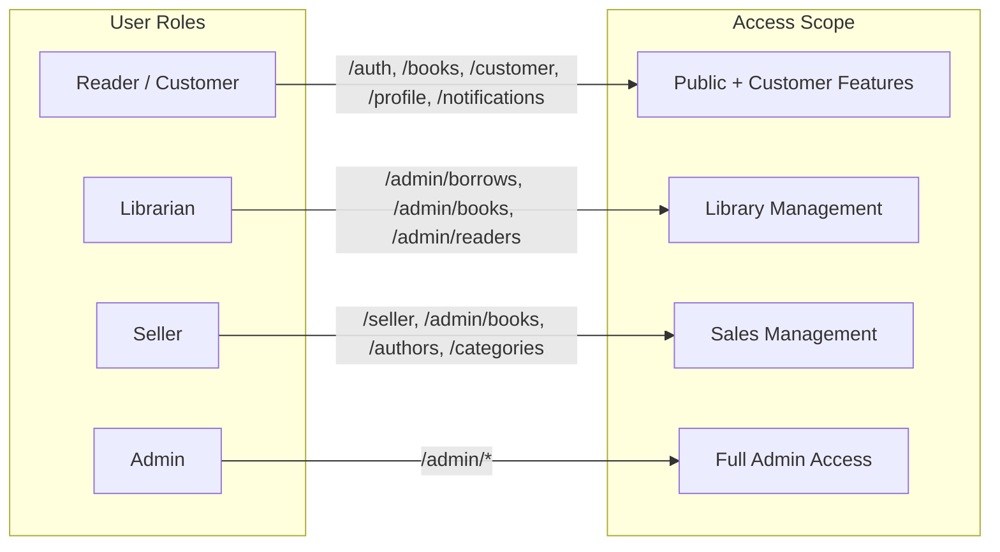
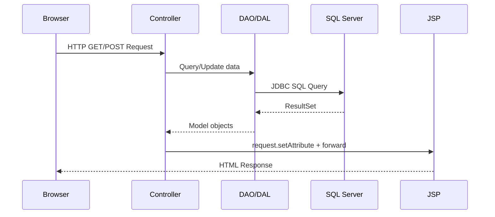

# Package Diagram - Digital Library Management System (SWP391-GR3)

## Tổng quan kiến trúc

Hệ thống được xây dựng theo mô hình **MVC (Model-View-Controller)** trên nền tảng **Java EE (Jakarta EE)** với **Apache Tomcat** làm web server và **Microsoft SQL Server** làm cơ sở dữ liệu.

---

## Package Diagram (Mermaid)

```mermaid
graph TB
    subgraph CLIENT["🌐 Client Layer"]
        BROWSER["Browser / HTTP Client"]
    end

    subgraph WEB["📁 web/ - View Layer (JSP)"]
        subgraph JSP_AUTH["jsp/auth/"]
            A1["login.jsp"]
            A2["register.jsp"]
            A3["forgot-password.jsp"]
            A4["reset-password.jsp"]
            A5["verify-otp.jsp"]
            A6["verify-google-otp.jsp"]
        end

        subgraph JSP_BOOKS["jsp/books/"]
            B1["list.jsp"]
            B2["detail.jsp"]
            B3["form.jsp"]
            B4["preview.jsp"]
            B5["upload.jsp"]
        end

        subgraph JSP_AUTHORS["jsp/authors/"]
            AU1["list.jsp"]
            AU2["detail.jsp"]
            AU3["form.jsp"]
        end

        subgraph JSP_CATEGORIES["jsp/categories/"]
            C1["list.jsp"]
            C2["detail.jsp"]
            C3["form.jsp"]
        end

        subgraph JSP_CUSTOMER["jsp/customer/"]
            CU1["home_1.jsp"]
            CU2["browse-books.jsp"]
            CU3["book-detail.jsp"]
            CU4["cart.jsp"]
            CU5["checkout.jsp"]
            CU6["orders.jsp"]
            CU7["my-library.jsp"]
            CU8["borrow-request.jsp"]
            CU9["borrowed-items.jsp"]
            CU10["fines.jsp"]
            CU11["reservations.jsp"]
            CU12["bookmarks.jsp"]
            CU13["reading-history.jsp"]
            CU14["reviews.jsp"]
            CU15["read.jsp"]
            CU16["notifications.jsp"]
            CU17["profile.jsp"]
        end

        subgraph JSP_ADMIN["jsp/admin/"]
            AD1["dashboard.jsp"]
            AD2["book-list.jsp"]
            AD3["book-form.jsp"]
            AD4["borrow-list.jsp"]
            AD5["borrow-detail.jsp"]
            AD6["employees.jsp"]
            AD7["users.jsp"]
            AD8["role-list.jsp"]
            AD9["sales-report.jsp"]
            AD10["sales-analytics.jsp"]
        end

        subgraph JSP_SELLER["jsp/seller/"]
            SE1["dashboard.jsp"]
            SE2["sales-report.jsp"]
            SE3["sales-analytics.jsp"]
        end

        subgraph JSP_PROFILE["jsp/profile/"]
            PR1["view-profile.jsp"]
            PR2["edit-profile.jsp"]
            PR3["change-password.jsp"]
            PR4["linked-accounts.jsp"]
        end

        subgraph JSP_NOTIF["jsp/notifications/"]
            NO1["inbox.jsp"]
        end

        subgraph JSP_LIBRARIAN["jsp/librarian/"]
            LI1["dashboard.jsp"]
        end

        subgraph INCLUDES["includes/"]
            INC1["header.jsp"]
            INC2["footer.jsp"]
            INC3["navbar.jsp"]
        end

        INDEX["index.jsp"]
    end

    subgraph CTRL["☕ controller/ - Controller Layer"]
        subgraph CTRL_MAIN["controller (main)"]
            CT1["AuthController"]
            CT2["BookController"]
            CT3["AuthorController"]
            CT4["CategoryController"]
            CT5["CustomerController"]
            CT6["ProfileController"]
            CT7["NotificationController"]
            CT8["BookFileController"]
        end

        subgraph CTRL_ADMIN["controller.admin"]
            CA1["AdminDashboardServlet"]
            CA2["AdminBookListServlet"]
            CA3["AdminBookFormServlet"]
            CA4["AdminBookDetailServlet"]
            CA5["AdminBookDeleteServlet"]
            CA6["AdminBorrowListServlet"]
            CA7["AdminBorrowDetailServlet"]
            CA8["AdminBorrowApproveServlet"]
            CA9["AdminEmployeeListServlet"]
            CA10["AdminEmployeeFormServlet"]
            CA11["AdminReaderListServlet"]
            CA12["AdminReaderFormServlet"]
            CA13["AdminRoleListServlet"]
            CA14["AdminSalesReportServlet"]
            CA15["AdminSalesAnalyticsServlet"]
            CA16["HomeServlet"]
        end

        subgraph CTRL_SELLER["controller.seller"]
            CS1["SalesReportServlet"]
            CS2["SalesAnalyticsServlet"]
        end
    end

    subgraph DAO_LAYER["☕ dao/ + dal/ - Data Access Layer"]
        subgraph DAO["dao/ (Main DAO)"]
            D1["BookDAO"]
            D2["AuthorDAO"]
            D3["CategoryDAO"]
            D4["ReaderDAO"]
            D5["EmployeeDAO"]
            D6["CartDAO"]
            D7["OrderDAO"]
            D8["PaymentDAO"]
            D9["ReviewDAO"]
            D10["BookmarkDAO"]
            D11["NotificationDAO"]
            D12["LinkedAccountDAO"]
            D13["ReadingHistoryDAO"]
            D14["ReaderBookOwnershipDAO"]
            D15["RoleDAO"]
        end

        subgraph DAL["dal/ (Library DAL)"]
            DL1["BookDAO"]
            DL2["BorrowDAO"]
            DL3["ReaderDAO"]
            DL4["EmployeeDAO"]
            DL5["FineDAO"]
            DL6["OtpDAO"]
            DL7["PasswordResetDAO"]
            DL8["ReservationDAO"]
            DL9["AuthorDAO"]
            DL10["CategoryDAO"]
            DL11["RoleDAO"]
            DL12["DBContext"]
        end
    end

    subgraph MODEL["☕ model/ - Model Layer"]
        subgraph MODEL_USER["User Models"]
            M1["Reader"]
            M2["Employee"]
            M3["Role"]
            M4["ReaderAccount"]
            M5["LinkedAccount"]
            M6["GoogleAccount"]
            M7["GoogleUser"]
        end

        subgraph MODEL_BOOK["Book Models"]
            M8["Book"]
            M9["Author"]
            M10["Category"]
            M11["BookCopy"]
            M12["TopSellingBook"]
        end

        subgraph MODEL_BORROW["Borrow Models"]
            M13["Borrow"]
            M14["BorrowItem"]
            M15["BorrowRequest"]
            M16["BorrowRequestItem"]
            M17["BorrowedItemView"]
            M18["BorrowExtend"]
            M19["BorrowExtendView"]
            M20["Reservation"]
        end

        subgraph MODEL_COMMERCE["Commerce Models"]
            M21["Cart"]
            M22["CartItem"]
            M23["Order"]
            M24["OrderBook"]
            M25["Payment"]
        end

        subgraph MODEL_MISC["Other Models"]
            M26["Fine"]
            M27["FineType"]
            M28["FineView"]
            M29["Notification"]
            M30["Review"]
            M31["Bookmark"]
            M32["ReadingHistory"]
            M33["ReaderBookOwnership"]
            M34["PasswordResetToken"]
        end
    end

    subgraph UTIL["☕ util/ - Utility Layer"]
        U1["AuthUtil"]
        U2["DBUtil"]
        U3["EmailUtil"]
        U4["GoogleUtils"]
        U5["PasswordUtil"]
        U6["StringUtil"]
        U7["TokenUtil"]
        U8["VNPayUtil"]
        U9["VNPayConfig"]
        U10["PaginatedResult"]
        U11["TestConnection"]
    end

    subgraph EXTERNAL["🔌 External Services"]
        EXT1["Microsoft SQL Server\nDigitalLibraryDB"]
        EXT2["VNPay Payment Gateway"]
        EXT3["Google OAuth2 API"]
        EXT4["SMTP Email Server"]
    end

    %% Client to Controller
    BROWSER -->|HTTP Request| CTRL_MAIN
    BROWSER -->|HTTP Request| CTRL_ADMIN
    BROWSER -->|HTTP Request| CTRL_SELLER

    %% Controller to View
    CTRL_MAIN -->|forward/redirect| WEB
    CTRL_ADMIN -->|forward/redirect| JSP_ADMIN
    CTRL_SELLER -->|forward/redirect| JSP_SELLER

    %% Controller to DAO
    CTRL_MAIN -->|uses| DAO
    CTRL_MAIN -->|uses| DAL
    CTRL_ADMIN -->|uses| DAL
    CTRL_SELLER -->|uses| DAO

    %% Controller to Util
    CTRL_MAIN -->|uses| UTIL
    CTRL_ADMIN -->|uses| U1
    CTRL_SELLER -->|uses| U1

    %% DAO to Model
    DAO -->|returns/uses| MODEL
    DAL -->|returns/uses| MODEL

    %% DAO to DB
    DAO -->|JDBC| EXT1
    DAL -->|JDBC via DBContext| EXT1

    %% Util to External
    U8 -->|HTTP POST| EXT2
    U4 -->|OAuth2| EXT3
    U3 -->|SMTP| EXT4
```

---

## Mô tả chi tiết các Package

### 1. `controller` (Main Controllers)
Các Servlet xử lý request từ người dùng cuối (Reader/Customer):

| Class | URL Pattern | Chức năng |
|-------|-------------|-----------|
| [`AuthController`](../src/java/controller/AuthController.java) | `/auth/*` | Đăng ký, đăng nhập, đăng xuất, quên/reset mật khẩu, Google OAuth |
| [`BookController`](../src/java/controller/BookController.java) | `/books`, `/books/*` | Xem danh sách, chi tiết sách; quản lý sách (Librarian/Seller) |
| [`AuthorController`](../src/java/controller/AuthorController.java) | `/authors`, `/authors/*` | Quản lý tác giả |
| [`CategoryController`](../src/java/controller/CategoryController.java) | `/categories`, `/categories/*` | Quản lý danh mục |
| [`CustomerController`](../src/java/controller/CustomerController.java) | `/customer`, `/customer/*` | Giỏ hàng, đặt hàng, mượn sách, thư viện cá nhân |
| [`ProfileController`](../src/java/controller/ProfileController.java) | `/profile/*` | Xem/sửa hồ sơ, đổi mật khẩu, liên kết tài khoản |
| [`NotificationController`](../src/java/controller/NotificationController.java) | `/notifications/*` | Quản lý thông báo |
| [`BookFileController`](../src/java/controller/BookFileController.java) | `/bookfile/*` | Upload/download file sách PDF |

### 2. `controller.admin` (Admin Controllers)
Các Servlet dành cho Admin/Librarian quản lý hệ thống:

| Class | URL Pattern | Chức năng |
|-------|-------------|-----------|
| [`AdminDashboardServlet`](../src/java/controller/admin/AdminDashboardServlet.java) | `/admin/dashboard` | Trang tổng quan Admin |
| [`AdminBookListServlet`](../src/java/controller/admin/AdminBookListServlet.java) | `/admin/books` | Danh sách sách (Admin) |
| [`AdminBorrowListServlet`](../src/java/controller/admin/AdminBorrowListServlet.java) | `/admin/borrows` | Quản lý mượn sách |
| [`AdminEmployeeListServlet`](../src/java/controller/admin/AdminEmployeeListServlet.java) | `/admin/employees` | Quản lý nhân viên |
| [`AdminReaderListServlet`](../src/java/controller/admin/AdminReaderListServlet.java) | `/admin/readers` | Quản lý độc giả |
| [`AdminRoleListServlet`](../src/java/controller/admin/AdminRoleListServlet.java) | `/admin/roles` | Quản lý vai trò |

### 3. `controller.seller` (Seller Controllers)
Các Servlet dành cho Seller:

| Class | URL Pattern | Chức năng |
|-------|-------------|-----------|
| [`SalesReportServlet`](../src/java/controller/seller/SalesReportServlet.java) | `/seller/sales-report` | Báo cáo doanh thu |
| [`SalesAnalyticsServlet`](../src/java/controller/seller/SalesAnalyticsServlet.java) | `/seller/sales-analytics` | Phân tích bán hàng |

### 4. `dao` (Data Access Objects - Main)
DAO cho các tính năng thương mại điện tử và người dùng:

| Class | Chức năng |
|-------|-----------|
| [`BookDAO`](../src/java/dao/BookDAO.java) | CRUD sách, tìm kiếm, phân trang |
| [`AuthorDAO`](../src/java/dao/AuthorDAO.java) | CRUD tác giả |
| [`CategoryDAO`](../src/java/dao/CategoryDAO.java) | CRUD danh mục |
| [`ReaderDAO`](../src/java/dao/ReaderDAO.java) | Quản lý độc giả |
| [`CartDAO`](../src/java/dao/CartDAO.java) | Giỏ hàng |
| [`OrderDAO`](../src/java/dao/OrderDAO.java) | Đơn hàng |
| [`PaymentDAO`](../src/java/dao/PaymentDAO.java) | Thanh toán VNPay |
| [`ReviewDAO`](../src/java/dao/ReviewDAO.java) | Đánh giá sách |
| [`BookmarkDAO`](../src/java/dao/BookmarkDAO.java) | Đánh dấu sách |
| [`NotificationDAO`](../src/java/dao/NotificationDAO.java) | Thông báo |
| [`LinkedAccountDAO`](../src/java/dao/LinkedAccountDAO.java) | Liên kết tài khoản Google |
| [`ReadingHistoryDAO`](../src/java/dao/ReadingHistoryDAO.java) | Lịch sử đọc sách |
| [`ReaderBookOwnershipDAO`](../src/java/dao/ReaderBookOwnershipDAO.java) | Sách đã mua/sở hữu |

### 5. `dal` (Data Access Layer - Library)
DAO cho các tính năng thư viện truyền thống (mượn/trả sách):

| Class | Chức năng |
|-------|-----------|
| [`DBContext`](../src/java/dal/DBContext.java) | Kết nối SQL Server |
| [`BorrowDAO`](../src/java/dal/BorrowDAO.java) | Mượn/trả sách vật lý |
| [`FineDAO`](../src/java/dal/FineDAO.java) | Phạt trễ hạn |
| [`ReservationDAO`](../src/java/dal/ReservationDAO.java) | Đặt trước sách |
| [`OtpDAO`](../src/java/dal/OtpDAO.java) | OTP xác thực |
| [`PasswordResetDAO`](../src/java/dal/PasswordResetDAO.java) | Reset mật khẩu |

### 6. `model` (Domain Models)
Các POJO đại diện cho dữ liệu nghiệp vụ.

### 7. `util` (Utilities)

| Class | Chức năng |
|-------|-----------|
| [`AuthUtil`](../src/java/util/AuthUtil.java) | Kiểm tra xác thực, phân quyền (Admin/Librarian/Seller/Reader) |
| [`DBUtil`](../src/java/util/DBUtil.java) | Tiện ích kết nối DB |
| [`EmailUtil`](../src/java/util/EmailUtil.java) | Gửi email (OTP, reset password) |
| [`GoogleUtils`](../src/java/util/GoogleUtils.java) | Tích hợp Google OAuth2 |
| [`PasswordUtil`](../src/java/util/PasswordUtil.java) | Hash/verify mật khẩu |
| [`VNPayUtil`](../src/java/util/VNPayUtil.java) | Tạo URL thanh toán VNPay |
| [`PaginatedResult`](../src/java/util/PaginatedResult.java) | Phân trang kết quả |

---

## Sơ đồ phân quyền theo Role

---

## Luồng dữ liệu chính

---

## Tích hợp dịch vụ ngoài

| Dịch vụ | Package sử dụng | Mục đích |
|---------|-----------------|----------|
| **VNPay** | [`util.VNPayUtil`](../src/java/util/VNPayUtil.java), [`util.VNPayConfig`](../src/java/util/VNPayConfig.java) | Thanh toán mua sách online |
| **Google OAuth2** | [`util.GoogleUtils`](../src/java/util/GoogleUtils.java), [`dao.LinkedAccountDAO`](../src/java/dao/LinkedAccountDAO.java) | Đăng nhập bằng Google |
| **SMTP Email** | [`util.EmailUtil`](../src/java/util/EmailUtil.java) | Gửi OTP, reset mật khẩu |
| **SQL Server** | [`dal.DBContext`](../src/java/dal/DBContext.java), [`util.DBUtil`](../src/java/util/DBUtil.java) | Lưu trữ dữ liệu |
