# Sequence Diagrams - Digital Library Management System

## 1. Đăng ký tài khoản Reader

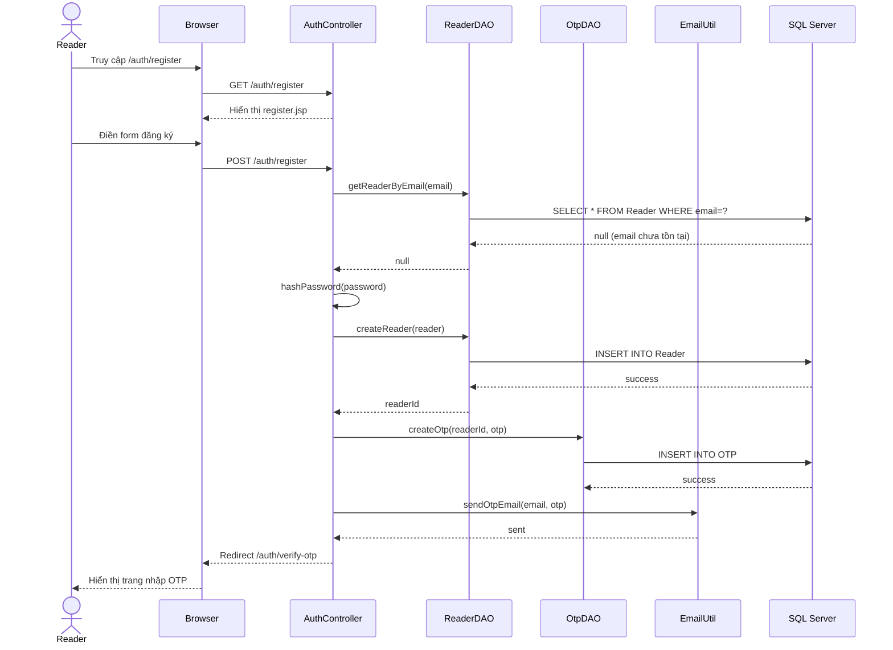

---

## 2. Đăng nhập (Reader & Employee)

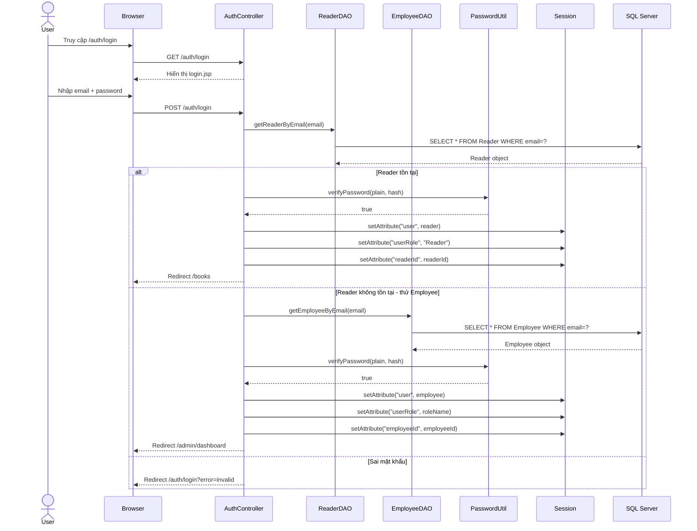

---

## 3. Đăng nhập bằng Google OAuth2

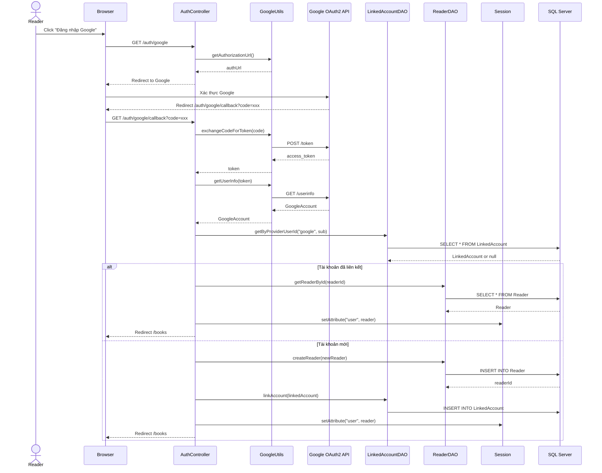

---

## 4. Quên mật khẩu / Reset mật khẩu

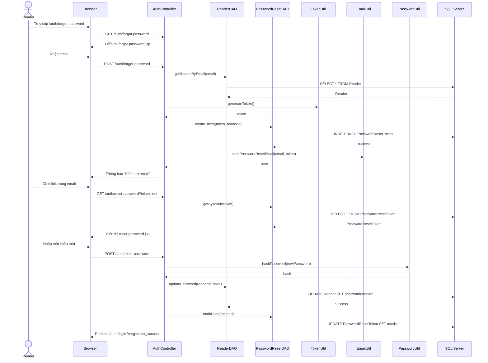

---

## 5. Xem danh sách sách và tìm kiếm

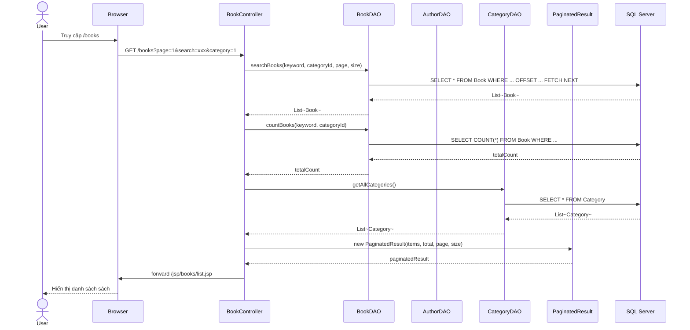

---

## 6. Mua sách (Thêm vào giỏ → Checkout → Thanh toán VNPay)

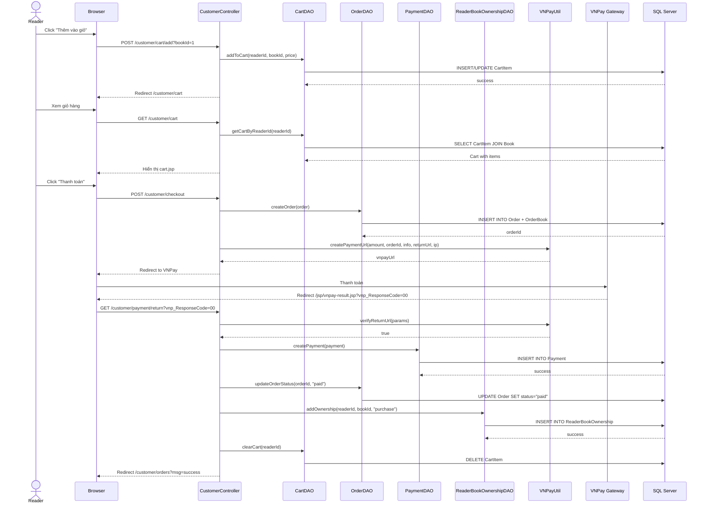

---

## 7. Yêu cầu mượn sách (Reader → Librarian duyệt)

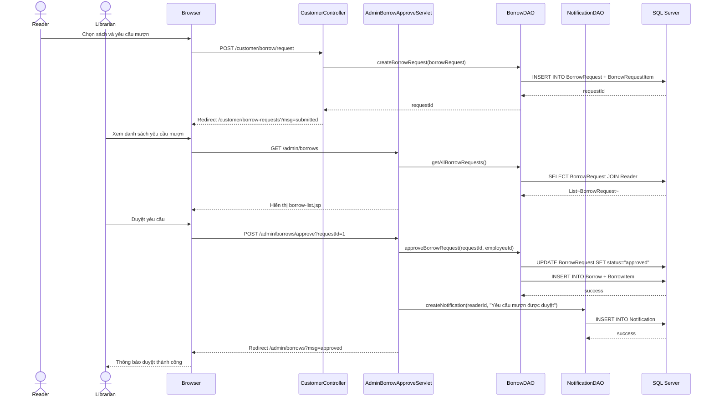

---

## 8. Trả sách và tính phạt

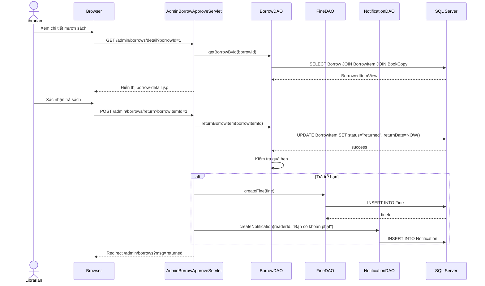

---

## 9. Đọc sách online (Reader)

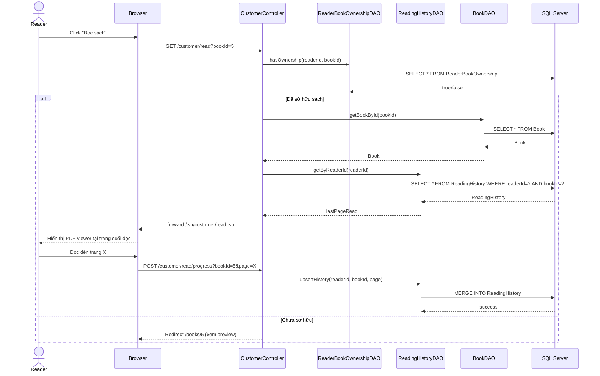

---

## 10. Quản lý nhân viên (Admin)

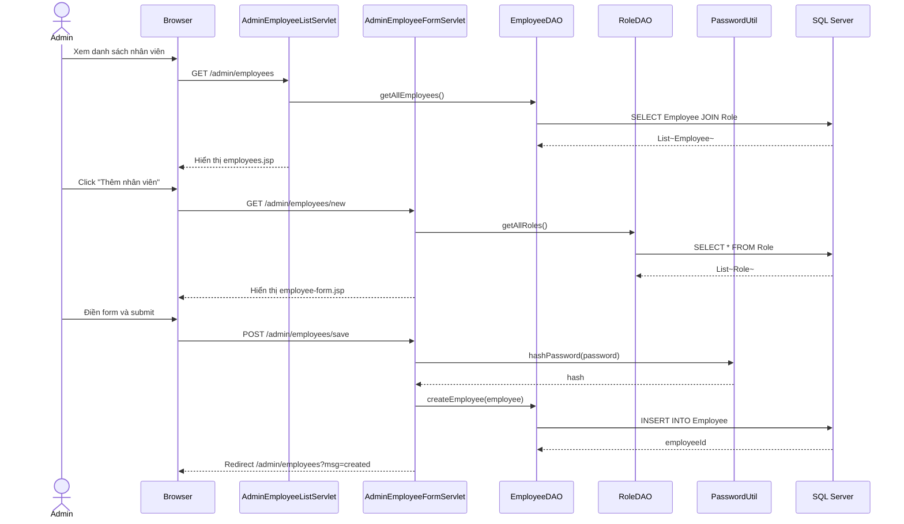

---

## 11. Xem báo cáo doanh thu (Seller)

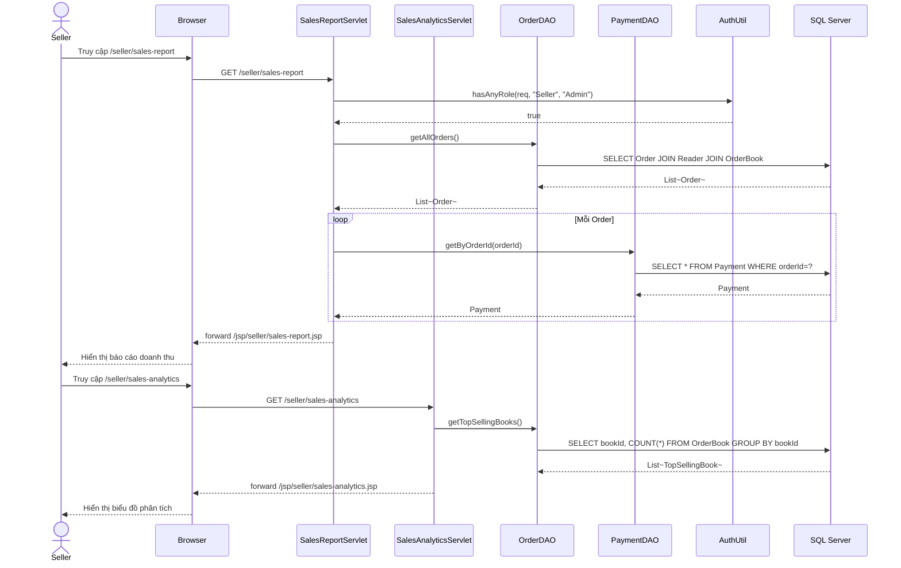

---

## 12. Quản lý sách (Librarian/Seller thêm/sửa sách)

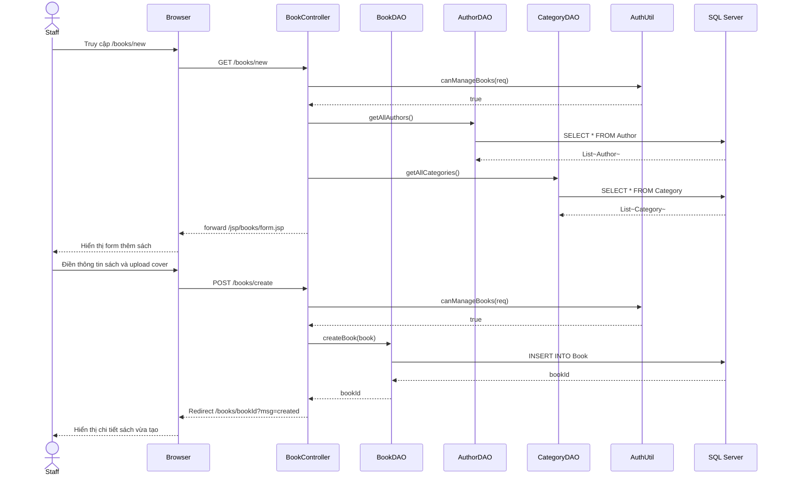

---

## 13. Đặt trước sách (Reservation)

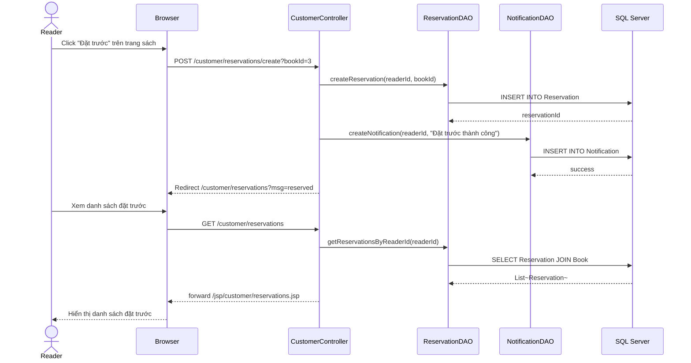

---

## 14. Viết đánh giá sách (Review)

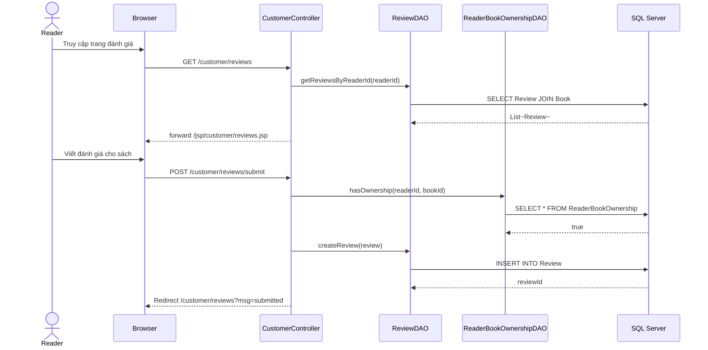

---

## 15. Quản lý thông báo (Notification)

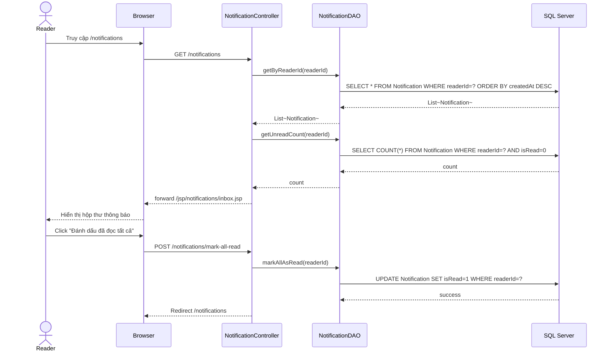
